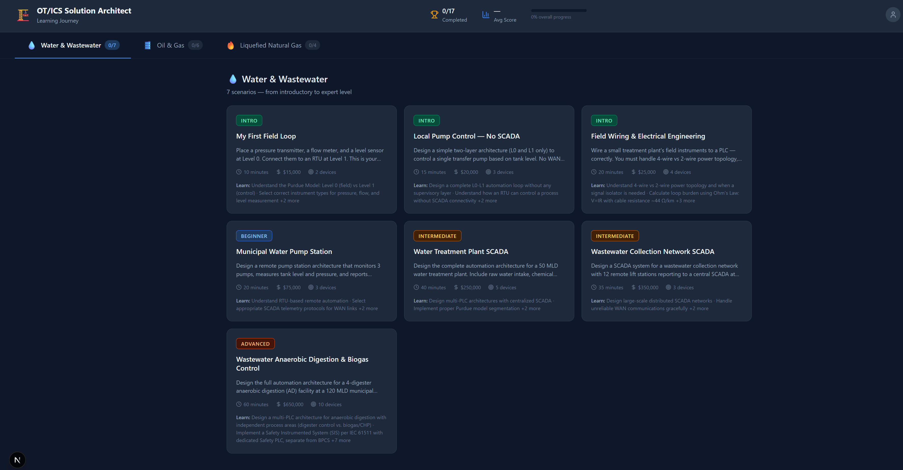
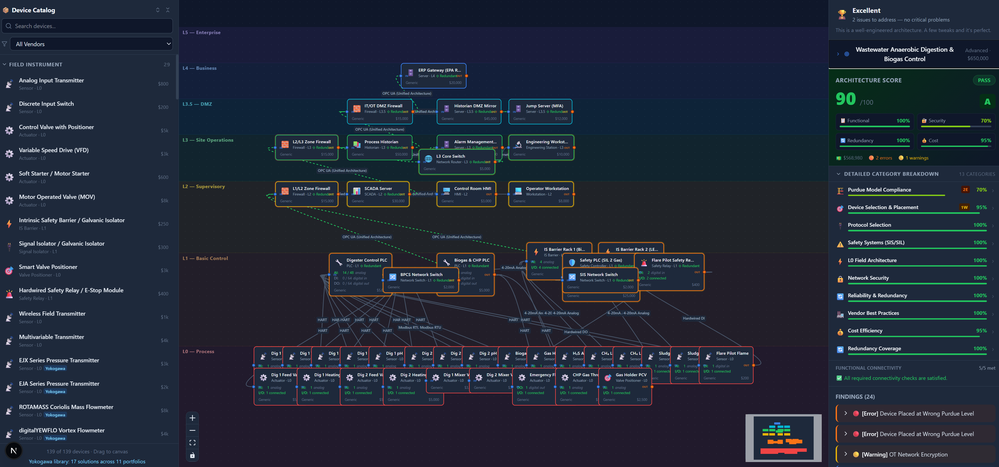
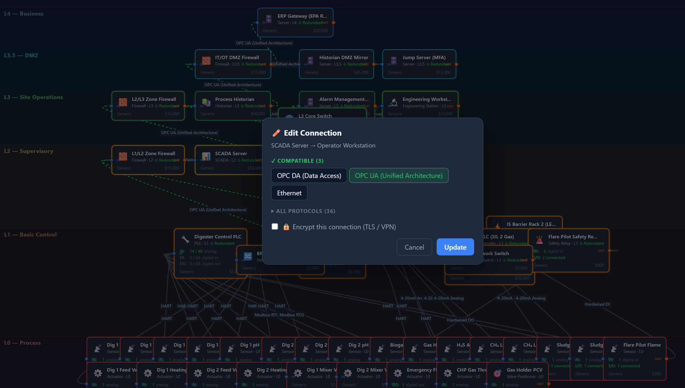
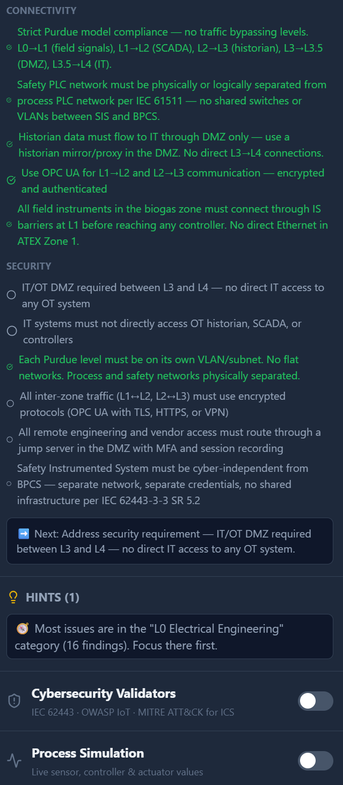

# OT/ICS Solution Architect Trainer

  
  
  
  
  

Interactive OT/ICS architecture training for students, practitioners, and industrial teams.

## Live Demo

- **App**: [ot-isc-architect.web.app](https://ot-isc-architect.web.app/)
- **Source (public)**: [github.com/hossamido/OT-ISC-Architect](https://github.com/hossamido/OT-ISC-Architect)
- **Product overview**: <!-- link to video or landing page -->
- **Demo request**: <!-- link to contact form or calendar -->

## What It Is

OT/ICS Solution Architect Trainer is a hands-on learning platform for designing industrial architectures across Water, Oil & Gas, and LNG use cases.

Instead of drawing generic diagrams, users work inside a training environment that understands:

- Purdue Model levels
- IEC 62443 zones and conduits
- IEC 61511 safety separation
- Industrial protocol fit and misuse
- Standards-linked design feedback

The result is a guided way to learn **how to build OT/ICS systems correctly before working in live projects or lab environments**.

## Who It Is For

- Students learning industrial automation and OT cybersecurity
- Trainees preparing for lab-based OT/ICS work
- Control engineers and system integrators improving architecture skills
- Instructors who need scenario-based OT/ICS design exercises

## Why It Is Different

| Generic diagram tool | OT/ICS Solution Architect Trainer |
|---|---|
| Draws shapes | Evaluates real OT/ICS architecture decisions |
| No protocol awareness | Understands industrial protocols and level fit |
| No standards traceability | Maps findings to IEC 62443, IEC 61511, NIST 800-82, OWASP IoT, MITRE ATT&CK for ICS |
| No learning path | Structured scenarios with guided progression |
| No coaching | Explains why a design is weak and how to improve it |

## Core Capabilities

- Scenario-based OT/ICS architecture exercises
- Real-time validation against cybersecurity and control-system rules
- Purdue-aware device placement and network segmentation checks
- Protocol coaching for OPC UA, Modbus, HART, and related OT communications
- Scoring across completeness, security, redundancy, and cost efficiency
- Exportable architecture review artifacts for teaching and assessment

## Example Use Cases

- Prepare students before they enter expensive or time-constrained OT labs
- Train junior engineers on Purdue, SCADA, DCS, SIS, and DMZ design patterns
- Run instructor-led workshops around architecture best practices
- Use as pre-lab preparation before vendor-specific or hardware-specific environments

## Product Positioning

This product is best positioned as a **pre-lab and pre-project architecture trainer**.

It helps learners build the mental model first:

- how to structure OT networks
- how to separate BPCS and SIS correctly
- how to route historian and enterprise data safely
- how to choose protocols that fit both process and cybersecurity constraints

## Screenshots

<!-- Copy screenshots from the private repo into an assets/ folder here -->

| Learning Journey | Architecture Workspace |
|:---:|:---:|
|  |  |

| Protocol Selection | Guidance & Feedback |
|:---:|:---:|
|  |  |

## Access Model

The core product source and validation engine are in a private repository.

This public repository showcases the platform, explains the value proposition, and directs users to the deployed experience or a demo request flow.

## Tech Stack

| Layer | Technology |
|-------|-----------|
| Framework | Next.js 16 |
| UI Library | React 19 |
| Language | TypeScript 6 (strict mode) |
| Canvas | @xyflow/react (React Flow) 12 |
| Styling | Tailwind CSS 4 |
| Testing | Vitest 4 |
| Hosting | Firebase Hosting |
| Auth | Firebase Authentication |

## License

This project is licensed under the [MIT License](LICENSE).

## Contact

<!-- Replace these placeholders with real URLs -->
- **LinkedIn**: <!-- your LinkedIn URL -->
- **Email**: <!-- your contact email -->
- **Demo request**: <!-- form or calendar link -->
